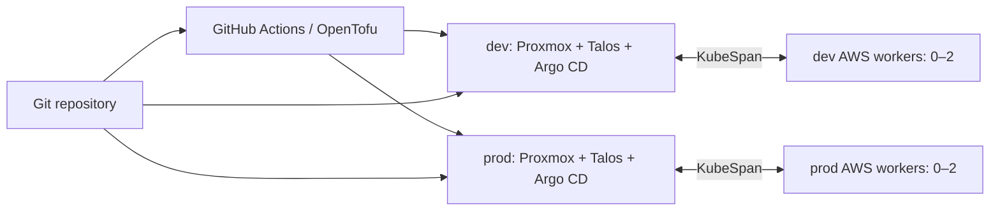

# Talos on Proxmox, with AWS burst workers

Two independent Kubernetes environments, **dev** and **prod**, run Talos on fixed Proxmox VMs. Each can add stateless AWS workers when workloads need more capacity. OpenTofu provisions the infrastructure; each cluster's Argo CD manages its applications; Doppler supplies credentials.

Persistent workloads stay on Proxmox, on local-path node storage in both environments. Prod runs three control-plane VMs, one per Proxmox host, that also run workloads; only `prod-server1` sits on SSD, so write-heavy volumes belong there. Each environment has its own state workspaces, Doppler config, AWS worker group, and Argo CD. Neither cluster manages the other.

## Start here

| I want to… | Read |
| --- | --- |
| Contribute, validate, or deploy | [Contributing and setup](CONTRIBUTING.md) |
| Understand provisioning, state, and CI | [Terraform and CI architecture](docs/architecture/terraform-ci.md) |
| Understand AWS networking and autoscaling | [Hybrid AWS worker architecture](docs/architecture/hybrid-aws-workers.md) |
| Understand application ownership and reconciliation | [GitOps and Argo CD architecture](docs/architecture/gitops.md) |
| Connect to a cluster or check its health | [Cluster access](docs/operations/cluster-access.md) |
| Schedule burst workloads or rotate their AWS key | [AWS worker operations](docs/operations/aws-burst-workers.md) |
| Find a credential's source and consumers | [Secrets reference](docs/reference/secrets.md) |

## Repository map

| Path | Contents |
| --- | --- |
| [`terraform/foundation/`](terraform/foundation/) | Operator-applied identities, Doppler tokens, GitHub Environments, HCP workspaces |
| [`terraform/cluster/`](terraform/cluster/) | Per-environment infrastructure root and node/network inventory |
| [`terraform/platform/`](terraform/platform/) | Per-environment CNI, Gateway API CRDs, ESO authentication, Argo CD bootstrap |
| [`terraform/proxmox/`](terraform/proxmox/) and [`terraform/aws/`](terraform/aws/) | Modules called by the cluster root |
| [`apps/argocd/`](apps/argocd/) | Bootstrap and shared platform Application charts |
| [`apps/components/`](apps/components/) | Component charts, vendored dependencies, environment overrides |
| [`.github/workflows/`](.github/workflows/) | Validation and provisioning workflows |
| [`openspec/`](openspec/) | Behavior specifications and archived change records |

Use `devenv shell` for the project's OpenTofu, Helm, Doppler, Talos, and Kubernetes tools. The [deployment guide](CONTRIBUTING.md) explains the account access and external services required before applying anything.
