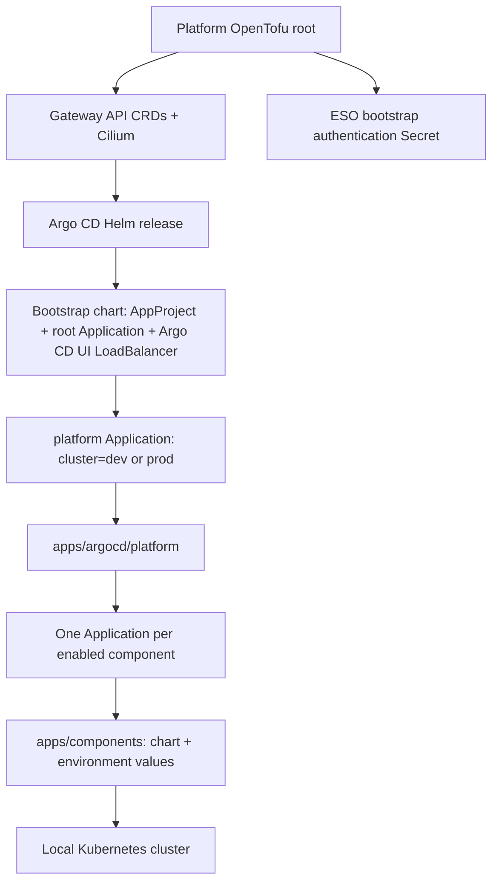
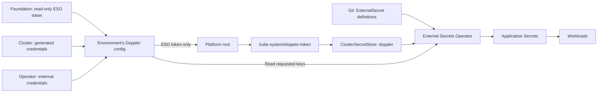

# GitOps and Argo CD architecture

[Documentation home](../../README.md) · [Cluster access](../operations/cluster-access.md)

Each environment runs its own Argo CD in namespace `argo-cd`. Both read the same public Git repository and shared platform chart, but each renders only its own components and targets its local Kubernetes API.

## Bootstrap and reconciliation



The [bootstrap chart](../../apps/argocd/bootstrap/) creates the `talos-proxmox` AppProject, the `platform` root Application and an Argo CD UI LoadBalancer Service. Cilium assigns and announces the reserved address once its GitOps-managed IP pool and L2 policy converge. The [platform chart](../../apps/argocd/platform/) creates child Applications from its component table. Every destination is `https://kubernetes.default.svc`; there are no remote-cluster registrations or cross-environment kubeconfigs.

## One owner per resource

| Owner | Components |
| --- | --- |
| Platform OpenTofu root | Gateway API CRDs, Cilium, ESO token namespace/Secret, Karpenter (CRDs, controller, `EC2NodeClass`, `NodePool`, and its AWS key Secret), Argo CD and bootstrap AppProject/root Application/UI LoadBalancer Service |
| Argo CD | ESO/store, Cilium address pools/L2 policies, storage, metrics, cloud controller, GPU components, Istio, operators, observability, telemetry agents, Cloudflare operator/CRDs and `ClusterTunnel`, and the HyperDX UI LoadBalancer Service |

Cilium and Argo CD remain OpenTofu-owned after bring-up. Changes to them go through a platform apply. Application changes go through Git and Argo CD.

An environment destroy removes the cluster and empties the platform root's state; it does not uninstall anything from the cluster. The platform root and Argo CD components must therefore not create external resources requiring removal on destroy, such as tailnet devices or unmanaged cloud resources. The cluster or foundation root owns the removal of external infrastructure, as the cluster root does for Karpenter's EC2 instances and launch templates. Existing Cloudflare tunnels may outlive destroys; see [public hostnames](#public-hostnames).

The `cilium-network` chart contains cluster-scoped networking resources; it does not install a second Cilium release.

## Membership, overlays, and ordering

The source of truth is [`apps/argocd/platform/values.yaml`](../../apps/argocd/platform/values.yaml). Each component declares its `clusters`, destination namespace, source path, and sync wave. Helm is the default source and requires a release name; `valueFilesByCluster` selects optional environment overrides. Set `sourceType: kustomize` for a Git-owned Kustomization path instead of a Helm chart.

| Wave | Components | Environments |
| --- | --- | --- |
| -3 | External Secrets Operator | dev, prod |
| -2 | Doppler ClusterSecretStore, Istio ambient (base, istiod, CNI, ztunnel) | dev, prod |
| -1 | Burst admission policy, Cilium network resources, metrics-server | dev, prod |
| -1 | Shared Argo Workflows controller and CRDs (Kubeflow workflows namespace) | prod |
| 0 | local-path, Talos CCM, cert-manager, CNPG, Strimzi, MongoDB operator | dev, prod |
| 0 | ClickHouse operator | prod |
| 1 | GPU operator, NVIDIA DRA | dev, prod |
| 1 | Observability store: ClickHouse, HyperDX, OTLP gateway | prod |
| 2 | Telemetry agents, Cloudflare operator and tunnel | dev, prod |

Dev's telemetry agents are its only dependency on prod: they send to prod's OTLP gateway at `10.69.12.129` with the shared ingest token. Dev converges without prod; only its telemetry export fails.

Waves order submission of child Applications; they do not wait for each child's resources to become healthy. Children converge asynchronously. Unlimited retries with backoff and `SkipDryRunOnMissingResource` handle dependencies such as CRDs arriving later. Automated prune removes resources deleted from Git, and self-heal repairs drift.

Argo CD uses server-side apply and server-side diff. Privileged component namespaces get labels through `managedNamespaceMetadata`. Cilium runs in `kube-system`; Istio runs in privileged `istio-system`.

## Secret delivery



The token Secret and Karpenter's `karpenter-aws` Secret are the Doppler-derived Kubernetes Secrets owned by OpenTofu. ESO owns the application Secrets, including the Cloudflare credentials Secret. Each store uses a read-only token scoped to its environment. Secret values never belong in Helm values files.

Application Secrets refresh hourly. Workloads that read credentials only at startup need an Argo CD Restart after the Secret refreshes. See [secret delivery and rotation](../reference/secrets.md#delivery-and-rotation).

## Public hostnames

Each environment has one Cloudflare tunnel, created once outside the cluster and named after it (`dev-talos`, `prod-talos`). The [`cloudflare-tunnel`](../../apps/components/cloudflare-tunnel/) chart installs the [Cloudflare operator](https://github.com/adyanth/cloudflare-operator) and a `ClusterTunnel` named `talos-proxmox` that runs that tunnel (`existingTunnel`) with a `cloudflared` Deployment in `cloudflare-operator-system`. The operator manifests and CRDs are vendored together from upstream kustomize output, since upstream ships no Helm chart. Never add public hostnames or other configuration to these tunnels in the Cloudflare dashboard: Cloudflare pushes dashboard configuration to `cloudflared`, replacing the ingress rules the operator writes.

Argo CD and HyperDX are exposed on LAN-only LoadBalancer Services, not through Cloudflare tunnels or Istio Gateways. Argo CD uses `10.69.11.254` (dev) and `10.69.12.254` (prod); HyperDX uses `10.69.12.128` (prod). Their original ClusterIP Services stay internal, and each UI LoadBalancer exposes only HTTP port 80. Application repositories can still publish their own hostnames by rendering bindings next to their origin Services. For each subject, the operator adds an ingress rule to the tunnel's configuration, restarts `cloudflared`, and creates a proxied CNAME plus a `_managed.<hostname>` TXT ownership record in the `phuchoang.sbs` zone. Deleting the binding removes both records.

```yaml
apiVersion: networking.cfargotunnel.com/v1alpha1
kind: TunnelBinding
metadata:
  name: web
  namespace: example
subjects:
  - name: web
    spec:
      fqdn: web-dev.phuchoang.sbs
tunnelRef:
  kind: ClusterTunnel
  name: talos-proxmox
```

The operator refuses a hostname whose existing record has no ownership TXT record, or whose TXT record belongs to another tunnel. Delete such records in Cloudflare before binding the hostname. Because dev and prod share the zone, each environment can only claim hostnames that the other does not own.

An environment destroy leaves the tunnel and its DNS records in Cloudflare. The rebuilt environment runs the same tunnel, so the operator recognizes its ownership records and takes the hostnames back without changes.

## Change a component

1. Edit its chart or values under [`apps/components/`](../../apps/components/). Keep vendored dependencies and `Chart.lock` consistent when changing a dependency.
2. For environment-specific settings, add or edit an overlay and reference it in `valueFilesByCluster`. To add/remove an environment, edit the component's `clusters` list.
3. Lint/render the chart locally, then submit the Git change. CI validates the component charts and dev/prod platform definitions.
4. After merging to `main`, check that environment's Application for Synced/Healthy status.

Removing an environment from `clusters` removes its child Application; the child Application's resource finalizer performs cascading cleanup. Inspect what it owns before removing a storage component.

To inspect rendered membership without connecting to a cluster:

```bash
helm template platform apps/argocd/platform \
  --namespace argo-cd --set cluster=dev --kube-version 1.36.3
```

For deployment status and UI addresses, use [cluster access](../operations/cluster-access.md).
