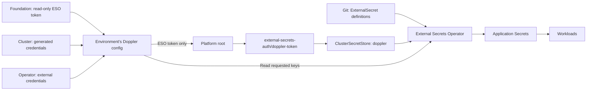

# GitOps and Argo CD architecture

[Documentation home](../../README.md) · [Cluster access](../operations/cluster-access.md)

Each environment runs its own Argo CD in namespace `argo-cd`. Both read the same public Git repository and shared platform chart, but each renders only its own components and targets its local Kubernetes API.

## Bootstrap and reconciliation


The [bootstrap chart](../../apps/argocd/bootstrap/) creates the `talos-proxmox` AppProject, the `platform` root Application, and the Gateway and HTTPRoute for the Argo CD UI, whose address comes from its per-environment overlay. The [platform chart](../../apps/argocd/platform/) creates child Applications from its component table. Every destination is `https://kubernetes.default.svc`; there are no remote-cluster registrations or cross-environment kubeconfigs.

## One owner per resource

| Owner | Components |
| --- | --- |
| Platform OpenTofu root | Gateway API CRDs, Cilium/SPIRE, ESO token namespace/Secret, Karpenter (CRDs, controller, `EC2NodeClass`, `NodePool`, and its AWS key Secret), Argo CD, bootstrap AppProject/root Application/UI route |
| Argo CD | ESO/store, Cilium address pools/L2 policies, storage, metrics, cloud controller, GPU components, routes, operators, observability, tunnel |

Cilium and Argo CD remain OpenTofu-owned after bring-up. Changes to them go through a platform apply. Application changes go through Git and Argo CD.

An environment destroy removes the cluster and empties the platform root's state; it does not uninstall anything from the cluster. The platform root and Argo CD components must therefore not create resources outside the cluster that need removing on destroy, such as DNS records, tailnet devices, or cloud resources. When a component does need one, the cluster or foundation root owns its removal, as the cluster root does for Karpenter's EC2 instances and launch templates. The Cloudflare tunnel exists outside the cluster and only its token is in the cluster, and Longhorn backups are meant to outlive it.

The `cilium-network` chart contains cluster-scoped networking resources; it does not install a second Cilium release.

## Membership, overlays, and ordering

The source of truth is [`apps/argocd/platform/values.yaml`](../../apps/argocd/platform/values.yaml). Each component declares its `clusters`, destination namespace, release name, chart path, and sync wave. `valueFilesByCluster` selects optional environment overrides.

| Wave | Components | Environments |
| --- | --- | --- |
| -3 | External Secrets Operator | dev, prod |
| -2 | Doppler ClusterSecretStore | dev, prod |
| -1 | Burst admission policy, Cilium network resources, metrics-server | dev, prod |
| 0 | local-path | dev |
| 0 | Longhorn and backup/storage resources | prod |
| 0 | Talos CCM, CNPG, Strimzi, MongoDB operator | dev, prod |
| 1 | GPU operator, NVIDIA DRA, observability | dev, prod |
| 2 | Cloudflare tunnel | dev, prod |

Waves order submission of child Applications; they do not wait for each child's resources to become healthy. Children converge asynchronously. Unlimited retries with backoff and `SkipDryRunOnMissingResource` handle dependencies such as CRDs arriving later. Automated prune removes resources deleted from Git, and self-heal repairs drift.

Argo CD uses server-side apply and server-side diff. Privileged component namespaces get labels through `managedNamespaceMetadata`. Cilium and SPIRE share `kube-system`. The Longhorn pre-upgrade checker is disabled because its Helm hook ordering does not fit initial Argo CD reconciliation.

## Secret delivery



The token Secret and Karpenter's `karpenter-aws` Secret are the Doppler-derived Kubernetes Secrets owned by OpenTofu. ESO owns the tunnel and Longhorn credential Secrets. Each store uses a read-only token scoped to its environment. Secret values never belong in Helm values files.

Tunnel and Longhorn credentials refresh hourly. Workloads that read credentials only at startup need an Argo CD Restart after the Secret refreshes. See [secret delivery and rotation](../reference/secrets.md#delivery-and-rotation).

## Change a component

1. Edit its chart or values under [`apps/components/`](../../apps/components/). Keep vendored dependencies and `Chart.lock` consistent when changing a dependency.
2. For environment-specific settings, add or edit an overlay and reference it in `valueFilesByCluster`. To add/remove an environment, edit the component's `clusters` list.
3. Lint/render the chart locally, then submit the Git change. CI validates the component charts and dev/prod platform definitions.
4. After merging to `main`, check that environment's Application for Synced/Healthy status.

Removing an environment from `clusters` removes its child Application; the child Application's resource finalizer performs cascading cleanup. Inspect what it owns before removing a storage component.

To inspect rendered membership without connecting to a cluster:

```bash
helm template platform apps/argocd/platform \
  --namespace argo-cd --set cluster=dev --kube-version 1.36.3
```

For deployment status and UI addresses, use [cluster access](../operations/cluster-access.md).
