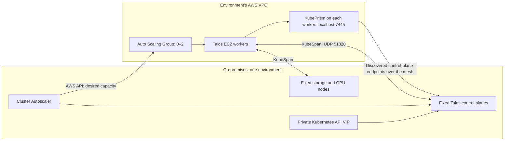
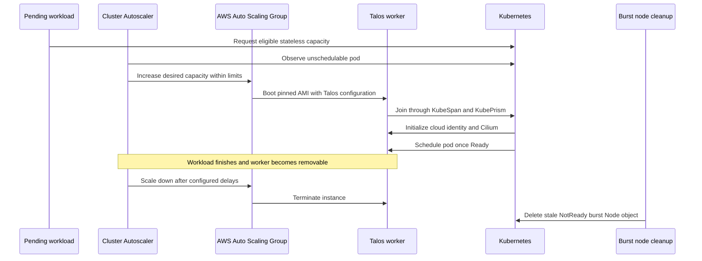

# Hybrid AWS worker architecture

[Documentation home](../../README.md) · [AWS worker operations](../operations/aws-burst-workers.md)

AWS workers extend each Talos cluster with temporary compute. Control planes, storage, GPU capacity, and the autoscaler remain on fixed Proxmox nodes, so the cluster can scale AWS capacity from zero.

## Topology

The diagram represents either dev or prod. Each has its own VPC, Auto Scaling Group (ASG), Talos identity, and autoscaler IAM user.

| Setting | dev | prod |
| --- | --- | --- |
| Cluster / ASG | `dev-talos` / `dev-talos-burst` | `prod-talos` / `prod-talos-burst` |
| VPC CIDR | `10.80.0.0/16` | `10.81.0.0/16` |
| Private API VIP | `10.69.11.10` | `10.69.12.10` |
| Default persistent storage | local-path | Longhorn |

Both use `us-east-1`, a public subnet in `us-east-1d`, and `m7i-flex.large` instances. Each group has minimum zero and maximum two workers. The launch template uses a 40 GiB disposable `gp3` boot disk and a pinned Talos AMI. This disk is node storage, not a Kubernetes EBS volume.

Configuration: [`terraform/aws/`](../../terraform/aws/) and the [environment variable files](../../terraform/cluster/env/).

## Network path

Talos discovery provides peer information. **KubeSpan** builds the encrypted WireGuard mesh between Talos nodes. Each AWS worker's **KubePrism** proxy selects discovered control-plane endpoints over that mesh. Cilium uses `localhost:7445` for API access and provides Kubernetes pod networking.

The private LAN VIP stays private. AWS workers do not require public TCP 6443 or a route to the VIP. The worker security group permits inbound UDP 51820 for KubeSpan and outbound traffic; the public subnet has an internet gateway. Discovery and mesh reachability must work before a worker can join.

Tailscale has a different role: it connects CI runners to the private management APIs. It is not the AWS workers' cluster network.

## Scale from zero, then return to zero

ASG tags advertise the future node's labels, taint, and measured allocatable capacity: **1950m CPU, 7274Mi memory, 32Gi ephemeral storage**. The autoscaler can evaluate pending pods before any AWS node exists. Requests larger than that template cannot trigger a useful scale-up.

Talos CCM initializes AWS node provider IDs such as `aws:///<zone>/<instance-id>`. The autoscaler recognizes the cloud-provider initialization and Cilium startup taints. OpenTofu ignores ASG `desired_capacity` after creation, so an infrastructure apply does not reset the autoscaler's current worker count.

The current autoscaler settings use a five-minute unneeded interval and five-minute delay after adding a node. Actual removal also depends on pod eviction constraints. The cleanup CronJob runs every five minutes and removes AWS-labeled nodes whose Ready condition has been non-True for over 15 minutes; it does not independently check EC2 termination.

## Keep persistent workloads on Proxmox

Workers register with:

| Marker | Value |
| --- | --- |
| Label | `burst.talos.dev/compute=aws` |
| Taint | `burst.talos.dev/stateless=true:NoSchedule` |

An eligible workload tolerates this taint and uses node affinity when it must run on AWS. Disposable `emptyDir` storage is allowed. The admission policy rejects PVC/generic-ephemeral workloads that tolerate the burst taint, StatefulSets with persistent claim templates and that toleration, and persistent Pods bound directly to an `ip-*` AWS node.

There is no AWS EBS CSI driver or Longhorn replica storage on burst workers. See the [workload example](../operations/aws-burst-workers.md#schedule-a-workload).

## Ownership and credentials

| Owner | Responsibility |
| --- | --- |
| Cluster OpenTofu root | VPC, subnet/routes, launch template, ASG bounds, autoscaler IAM user/key |
| Cluster Autoscaler | ASG desired worker count |
| Argo CD | Autoscaler, Talos CCM, burst admission policy, stale-node cleanup |
| Doppler and ESO | Delivery of the autoscaler's AWS key to its Deployment |

Each autoscaler key can scale only its environment's named group; AWS Describe permissions are account-wide. CI uses a separate OIDC provisioning role. Key rotation is an [OpenTofu replacement followed by an Argo CD restart](../operations/aws-burst-workers.md#rotate-the-autoscaler-key).

## Known operating limits

The existing deployment notes report roughly three minutes to worker readiness; treat this as an observation, not a deadline. Image startup, discovery, networking, and Cilium can change that timing.

Cilium's MTU is pinned to 1500 on both sites. Existing network observations report cross-site pod payloads up to 1370 bytes and dropped IP-fragmented pod traffic, including on-premises pairs. Site upload bandwidth also limits traffic to AWS. Validate the workload's traffic pattern before depending on burst capacity.

KubePrism can switch between healthy control planes in a multi-control-plane environment. Dev's single control plane has no such redundancy. The [platform health gate](terraform-ci.md#what-a-successful-apply-means) deliberately uses only fixed-node Kubernetes readiness when a burst node is registered.
