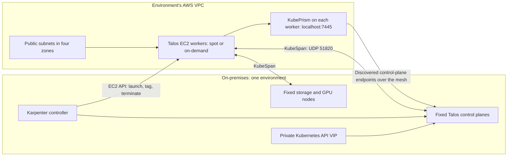
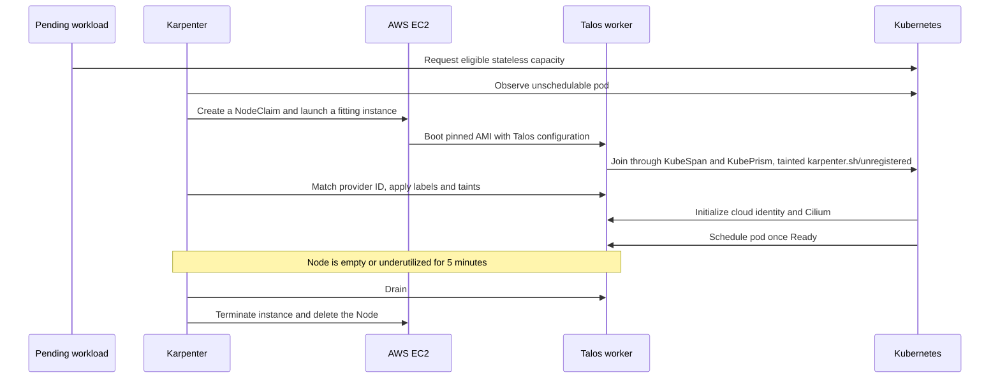

# Hybrid AWS worker architecture

[Documentation home](../../README.md) · [AWS worker operations](../operations/aws-burst-workers.md)

AWS workers extend each Talos cluster with temporary compute. Control planes, storage, GPU capacity, and the Karpenter controller remain on fixed Proxmox nodes, so the cluster can scale AWS capacity from zero. **Karpenter** launches EC2 instances directly from pending pods; there is no Auto Scaling Group.

## Topology

The diagram represents either dev or prod. Each has its own VPC, Talos identity, Karpenter controller, and Karpenter IAM user.

| Setting | dev | prod |
| --- | --- | --- |
| Cluster | `dev-talos` | `prod-talos` |
| VPC CIDR | `10.80.0.0/16` | `10.81.0.0/16` |
| Private API VIP | `10.69.11.10` | `10.69.12.10` |
| Default persistent storage | local-path | Longhorn |
| Karpenter replicas | 1 | 2 |

Both use `us-east-1` with one public subnet in each of `us-east-1a` through `us-east-1d`. There is a single `NodePool`, `aws-burst`, that allows amd64 `c`, `m`, and `r` instances of generation 6 or newer with 2, 4, or 8 vCPUs, on spot or on-demand capacity. It is limited to 8 CPUs and 32Gi of memory in total. Workers use a pinned Talos AMI and a 40 GiB disposable `gp3` boot disk. This disk is node storage, not a Kubernetes EBS volume.

Configuration: [`terraform/aws/`](../../terraform/aws/), [`terraform/platform/karpenter.tf`](../../terraform/platform/karpenter.tf), and [`apps/components/karpenter-nodes/`](../../apps/components/karpenter-nodes/).

## Network path

Talos discovery provides peer information. **KubeSpan** builds the encrypted WireGuard mesh between Talos nodes. Each AWS worker's **KubePrism** proxy selects discovered control-plane endpoints over that mesh. Cilium uses `localhost:7445` for API access and provides Kubernetes pod networking.

The private LAN VIP stays private. AWS workers do not require public TCP 6443 or a route to the VIP. The worker security group permits inbound UDP 51820 for KubeSpan and outbound traffic; the public subnets have an internet gateway. Discovery and mesh reachability must work before a worker can join.

Tailscale has a different role: it connects CI runners to the private management APIs. It is not the AWS workers' cluster network.

## Scale from zero, then return to zero

Karpenter picks an instance size that fits the pending pods, so requests must fit the largest allowed instance. A worker registers with the `karpenter.sh/unregistered` taint so nothing schedules before Karpenter labels it. Two startup taints, the cloud provider's `uninitialized` taint and Cilium's `agent-not-ready`, keep pods off until Talos CCM and Cilium finish; Karpenter does not count them against the node.

Talos CCM initializes AWS provider IDs such as `aws:///<zone>/<instance-id>`, which Karpenter uses to match each NodeClaim to its Node.

Karpenter predicts each instance type's allocatable capacity from the EC2NodeClass `kubelet` values. These are not applied to Talos. If they exceed what Talos actually reserves, Karpenter can launch a node a pod does not fit on.

## Spot instances and node replacement

The pool prefers spot capacity and falls back to on-demand. There is no interruption queue, so AWS reclaiming a spot instance gives no advance drain. Karpenter notices the missing instance, deletes the NodeClaim and Node, and launches capacity for the pods that became pending. Burst workloads are stateless, so this is expected. A workload that cannot tolerate it can require `karpenter.sh/capacity-type: on-demand` with a node selector.

Karpenter compares each worker with the current AMI and Talos worker configuration. When either changes, the worker is drifted and replaced, one node at a time. Workers are also replaced after 720 hours.

## Keep persistent workloads on Proxmox

Workers register with:

| Marker | Value |
| --- | --- |
| Label | `burst.talos.dev/compute=aws` |
| Taint | `burst.talos.dev/stateless=true:NoSchedule` |

An eligible workload tolerates this taint and uses node affinity when it must run on AWS. Disposable `emptyDir` storage is allowed. The admission policy rejects PVC/generic-ephemeral workloads that tolerate the burst taint, StatefulSets with persistent claim templates and that toleration, and persistent Pods bound directly to an `ip-*` AWS node.

There is no AWS EBS CSI driver or Longhorn replica storage on burst workers. See the [workload example](../operations/aws-burst-workers.md#schedule-a-workload).

## Ownership and credentials

| Owner | Responsibility |
| --- | --- |
| Cluster OpenTofu root | VPC, subnets, security group, worker IAM role and profile, Karpenter IAM user and key, worker Talos configuration |
| Platform OpenTofu root | Karpenter CRDs, controller, `EC2NodeClass`, `NodePool`, and the controller's AWS key Secret |
| Argo CD | Talos CCM and the burst admission policy |
| Doppler | Hand-off of the Karpenter key, worker machine configuration, and AMI ID from the cluster root to the platform root |

The platform root owns Karpenter so that a destroy can delete the `NodePool` and wait for Karpenter to terminate its instances before the controller is removed. Because the worker Talos configuration contains cluster secrets, the `EC2NodeClass` user data is applied from OpenTofu instead of Git. Anyone who can read `ec2nodeclasses` in the cluster can read it.

The Karpenter key can launch, tag, and terminate only instances tagged for its own cluster, in subnets and a security group tagged for it, from the pinned AMI. It can pass only the worker role, which has no permissions. AWS Describe permissions are regional. CI uses a separate OIDC provisioning role and never launches instances. Key rotation is [two OpenTofu applies](../operations/aws-burst-workers.md#rotate-the-karpenter-key).

## Known operating limits

Spot and on-demand capacity can be unavailable in a zone. Karpenter then tries other instance types and zones in the pool. Nothing schedules past the CPU and memory limits, and excess workloads stay Pending.

The existing deployment notes report roughly three minutes to worker readiness; treat this as an observation, not a deadline. Image startup, discovery, networking, and Cilium can change that timing.

Cilium's MTU is pinned to 1500 on both sites. Existing network observations report cross-site pod payloads up to 1370 bytes and dropped IP-fragmented pod traffic, including on-premises pairs. Site upload bandwidth also limits traffic to AWS. Validate the workload's traffic pattern before depending on burst capacity.

KubePrism can switch between healthy control planes in a multi-control-plane environment. Dev's single control plane has no such redundancy. The [platform apply](terraform-ci.md#what-a-successful-apply-means) checks API readiness and release installation; it does not gate on fixed or burst node health.
