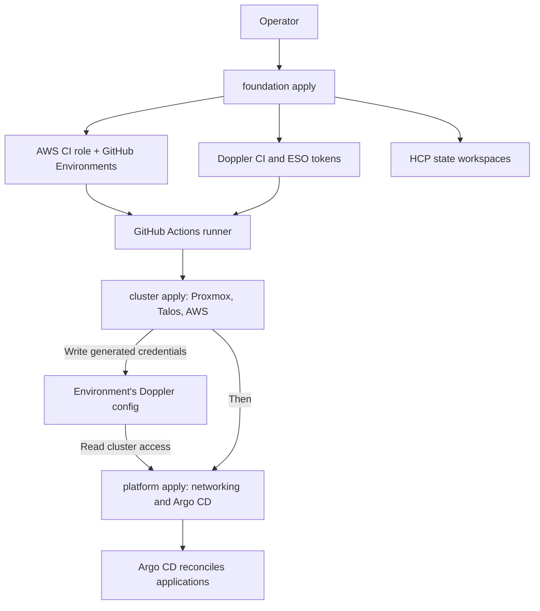
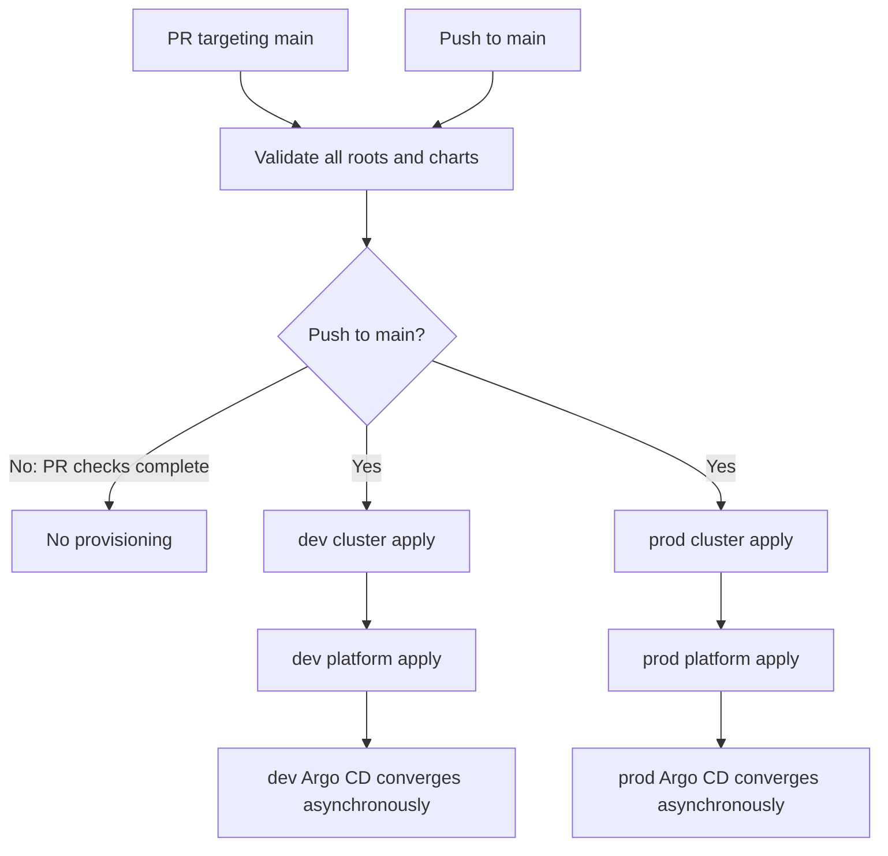

# Terraform and CI architecture

[Documentation home](../../README.md) · [Deploy the platform](../../CONTRIBUTING.md)

The repository uses Terraform configuration executed by **OpenTofu**. Three roots divide account setup, cluster infrastructure, and the components needed to start GitOps. Each root has its own state; generated credentials move between roots through Doppler.

## Roots and ownership

| Root | Applied by | Owns | HCP workspace |
| --- | --- | --- | --- |
| `foundation` | Operator | AWS CI identity, Doppler project/environments and service tokens, GitHub Environments, four state workspaces | `talos-proxmox` |
| `cluster` | CI, per environment | Proxmox VMs, Talos identity/configuration, AWS worker infrastructure, generated credentials | `talos-cluster-dev`, `talos-cluster-prod` |
| `platform` | CI, per environment | Gateway API CRDs, Cilium, ESO bootstrap token Secret, Argo CD with its root Application and UI route | `talos-platform-dev`, `talos-platform-prod` |

`terraform/proxmox` and `terraform/aws` are modules called by `cluster`, not separate deployment roots. Argo CD owns the remaining cluster components; see [GitOps architecture](gitops.md).

The separate platform root makes Kubernetes and Helm provider credentials available before its plan starts. It reads the kubeconfig and Talos config from Doppler and the fixed-node inventory from Git. No root reads another root's remote state.

## Workflow flow

| Workflow | Responsibility |
| --- | --- |
| [`terraform.yml`](../../.github/workflows/terraform.yml) | PR checks; on `main` pushes, deploy dev/prod in parallel with `fail-fast: false` |
| [`lint.yml`](../../.github/workflows/lint.yml) | Backend-disabled init, format and validate all roots; lint charts/overlays and verify vendored Gateway CRD checksum |
| [`provision.yml`](../../.github/workflows/provision.yml) | Reusable per-environment apply or destroy, restricted to `main` pushes/manual dispatches |
| [`manual.yml`](../../.github/workflows/manual.yml) | Validate, then apply or destroy one selected environment on `main` |

Provisioning runs are serialized per environment and do not cancel an active run. The job timeout is 90 minutes. Destroy reverses root order: platform, then cluster. Foundation is only validated by CI and must be applied locally.

## Credentials and network access

Each job gets its environment's `DOPPLER_TOKEN` from GitHub. It uses GitHub OIDC to assume the AWS provisioning role, reads HCP/Tailscale credentials from Doppler with masked exports, and joins Tailscale to reach private APIs.

| Access | Credential/path |
| --- | --- |
| AWS provisioning | Short-lived GitHub OIDC session; ambient AWS provider credentials |
| HCP state | `HCP_TERRAFORM_TOKEN`, exported as `TF_TOKEN_app_terraform_io` |
| Doppler | Environment-scoped read/write CI service token |
| Proxmox | `PROXMOX_*` read by the Doppler provider |
| Kubernetes and Talos | Generated `KUBECONFIG` and `TALOSCONFIG` read from Doppler |
| Private API routing | Tailscale runner identity `tag:ci` |

GitHub Environment deployment policies allow `main`; AWS trust is limited to the dev/prod environment subjects. PR validation does not use deployment secrets or remote state. Saved plans remain on the runner. See the [secrets reference](../reference/secrets.md) for ownership and consumers.

## State and environment isolation

All five HCP workspaces use local execution: HCP stores, versions, and locks state while OpenTofu runs on the operator's machine or CI runner. Cluster/platform roots select tagged workspaces through `TF_WORKSPACE`; validation checks that the selected workspace matches `env`.

The configured HCP operator token is shared across environments and can access their state. Workspace guards prevent accidental environment mismatch; they are not separate HCP authorization boundaries. State contains Talos identities, service tokens, and AWS keys, so access to it also grants access to those credentials.

## What a successful apply means

The platform first probes the API's authenticated `/readyz` endpoint, installs Gateway API CRDs, and installs Cilium. Its health gate then behaves as follows:

| Registered AWS burst nodes | Gate |
| --- | --- |
| None | Talos, etcd, and Kubernetes health checks using fixed inventory addresses, with a 15-minute timeout |
| Any, including a terminated NotReady node | Every fixed inventory node must be registered and Kubernetes Ready; Talos/etcd checks are skipped |

Argo CD installation depends on this gate. Cilium does not wait for SPIRE because SPIRE needs storage installed later by Argo CD. CI finishes after the root Application is installed, without waiting for all child Applications or SPIRE. Use the [convergence checks](../operations/cluster-access.md#check-convergence) afterward.

Implementation: [`health.tf`](../../terraform/platform/health.tf), [`network.tf`](../../terraform/platform/network.tf), [`argocd.tf`](../../terraform/platform/argocd.tf).
